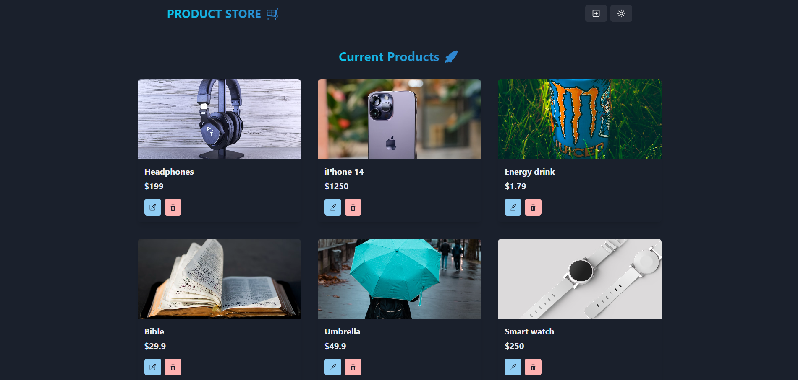

MERN-Store1



DEMO APP
[DEMO-APP DEPLOYMENT](https://mern-store1-piyt.onrender.com/)

### FUNKCE / INFO
-   Přidávání, mazání produktů a jejich upravování
-   dark/light mode
-   Tech Stack: React.js, Node.js, Express.js, MongoDB, Chakra UI
-   Error Handling
-   Responzivní UI w/ React.js a ChakraUI
-   Vlastní API
  

### Setup .env file

```shell
MONGO_URI=your_mongo_uri
PORT=5000
```

### Run this app locally

```shell
npm run build
```

### Start the app

```shell
npm run start
```
